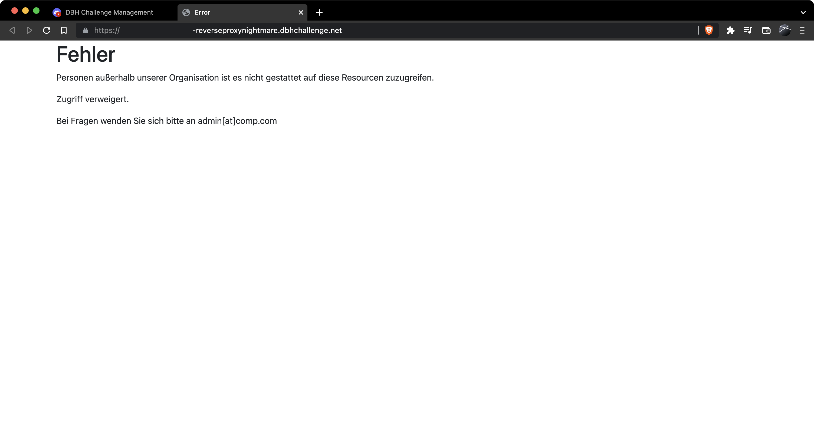

# web-reverseproxynightmare

## Lösungsvorschläge

Zuerst wird die Website nach Inhalten durchsucht. Außer einer Fehlermeldung, dass die Website für Benutzer außerhalb der Organisation nicht erreichbar ist, können keine weiteren hilfreichen Informationen ermittelt werden.


### Schwachstelle

Bei Hinzufügen eines `X-Forwarded-For` Headers zum GET Request ändert sich die Fehlermeldung wie folgt:

```text
Der angegebene IP Adressbereich (CIDR) ist ungültig.
```

Somit ist klar, die Schwachstelle ist der `X-Forwarded-For` Header.

Im nächsten Schritt muss der richtige IP-Adressbereich ausfinding gemacht werden.

In der Challenge sind alle IP-Adressen im Bereich `172.16.0.0/12 172.16.0.0–172.31.255.255` zulässig.

Nachdem der richtige `X-Forwarded-For` Header gesetzt wurde, präsentiert die Challenge eine interne Willkommensseite.

### Gobuster / Dirbuster

Mit Hilfe von Gobuster / Dirbuster oder durch einfaches Aufrufen der `robots.txt` kann der Name einer geheimen Seite `/s3cur3Fl4g.html` ermittelt werden.

Diese Seit beinhaltet die Flag.

## Beseitigung der Schwachstelle

Ein Client sollte niemals in der Lage sein mit Hilfe des `X-Forwarded-For` Headers die Client-IP des Anfragenden zu überschreiben. Die Technik ist nützlich um die "echte" oder "originale" Client-IP des Aufrufenden auch über Proxy-Server hinweg mitzusenden.

Um einen Missbrauch zu verhinden muss die Source-IP (z.B. die des Proxyservers) in einer Whitelist aufgeführt sein und es darf nur der letzte an den Request angefügte `X-Forwarded-For` Header gewertet werden.

Ein Beispiel für eine Konfiguration mit NGINX: https://stackoverflow.com/questions/66692200/nginx-check-if-cloudflare-forward-or-direct-ip-and-limit-accordingly/66809489#66809489

## Flag

DBH{Pr0xy_1s_aFr13nd_sdaf98asdf89asdf}
